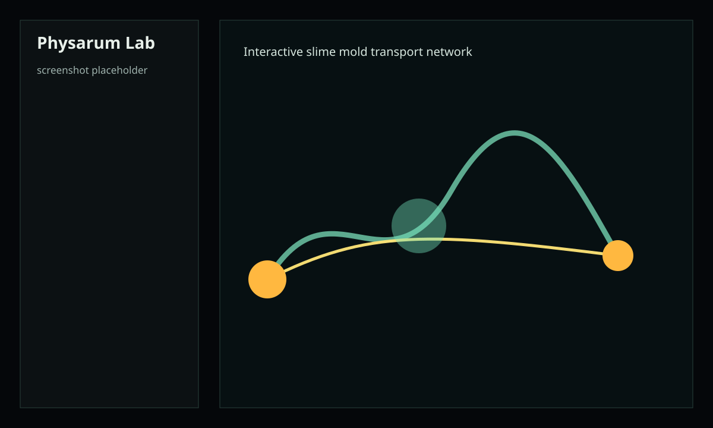

# Interactive Physarum Slime Mold Simulation

一个浏览器端交互式粘菌模拟网站。核心模拟用 C++20 编写，通过 Emscripten 编译为 WebAssembly；前端用 TypeScript + Vite + Canvas2D 负责 UI、渲染、鼠标交互、参数面板和导出。



## 功能概览

- 在画布上添加/擦除粘菌、食物和墙。
- 调整粘菌数量、食物热量、传感器、能量消耗、进食、生长、分裂、休眠、死亡参数。
- Jones 风格三传感器趋化模型，带 trail、food scent、repellent field。
- 能量越低越受食物吸引；长期饥饿会死亡，能量充足可分裂。
- 低分辨率 Physarum-inspired 网络图，含压力/流量/导度反馈与 Dijkstra 最短营养路径。
- 实时指标：存活数量、平均能量、剩余食物、总 trail、覆盖率、搜索比例、网络长度、传输成本、效率等。
- 一键导出当前 Canvas PNG、参数 JSON、状态 JSON。
- `docs/model.tex` 用 LaTeX 说明模型假设和公式。

## 依赖安装

需要 Node.js 20+、CMake 3.20+、C++20 编译器。首次安装：

```bash
npm install
```

## 安装 Emscripten

如果本机还没有 `emcmake`：

```bash
git clone https://github.com/emscripten-core/emsdk.git
cd emsdk
./emsdk install latest
./emsdk activate latest
source ./emsdk_env.sh
```

Windows PowerShell 可参考 Emscripten 官方文档，并确保当前 shell 能找到 `emcmake` 和 `em++`。

## 构建 WASM

```bash
npm run build:wasm
```

输出会写入：

```text
public/wasm/physarum.js
public/wasm/physarum.wasm
```

## 启动前端

```bash
npm run dev
```

打开 Vite 输出的本地地址。第一次运行前必须先执行 `npm run build:wasm`，否则页面会提示缺少 `/wasm/physarum.js`。

## 测试与生产构建

```bash
npm run test
npm run build
```

`npm run test` 会运行 Vitest 前端测试和 C++ 原生单元测试。`npm run build` 会做 TypeScript 检查并构建前端静态资源。

## 控件说明

- `Add Slime`：在鼠标位置添加一团 agent，数量由 `Brush agents` 决定。
- `Add Food`：添加食物源，热量、半径、吸引强度由参数面板决定。
- `Erase`：擦除粘菌、食物、trail 和墙。
- `Add Wall`：添加 repellent/wall 区域。
- `Inspect`：点击 agent 或 food 查看局部信息。
- `Seed Colony`：按当前 `Slime count` 在画布中心补充粘菌。
- `Reset`：用当前 `Random seed` 重置世界，并添加默认 colony 和两个食物源。
- `Export PNG` / `Export Params` / `Export State`：导出截图、参数和状态。

## 模型简短版

每个 agent 使用 front/front-left/front-right 三个传感器采样 trail、food scent 和 repellent。传感器得分决定转向；食物吸引力按剩余热量和饥饿程度混入方向。每步扣除基础代谢、移动、传感器和 trail 分泌成本，吃到食物则恢复能量。高能量个体可能分裂，低能量个体进入休眠，长期饥饿后死亡。

网络层从高 trail 区域和食物源构建低分辨率图，用近似压力方程计算流量，再用 `dD/dt = alpha |Q|^mu - lambda D` 更新导度。高流量路径会变粗，低流量路径衰退。Dijkstra 使用 `L / (D + epsilon)` 形式的权重高亮当前最短营养路径。

完整公式见 [docs/model.tex](docs/model.tex)。

## LaTeX 文档

如果安装了 TeX Live 或 MacTeX：

```bash
cd docs
pdflatex model.tex
bibtex model
pdflatex model.tex
pdflatex model.tex
```

生成的 PDF 会解释模型假设、变量、趋化、能量预算、搜索/利用决策、trail 扩散、网络流量、导度反馈和最短路径。

## 性能说明

- 初版目标支持约 5k 到 20k agents，具体取决于浏览器、CPU、网络图开启情况和画布尺寸。
- C++ 每帧执行多个 substeps，前端只读取 render buffer、agent typed array 和低频 JSON 指标。
- Canvas2D 版本优先保证稳定性；后续可把 field 和 agent 渲染迁移到 WebGL2。
- 如果帧率下降，可降低 `Slime count`、增大 `Graph stride`、关闭 `Show agents` 或关闭 `Enable solver`。

## 已知限制

- trail ridge extraction 是低分辨率网格近似，不是真正的骨架提取。
- graph conductivity 在每次图重建时以当前 trail 初始化，尚未做跨拓扑的长期持久映射。
- food scent 是从食物源重建的场，不是独立扩散 PDE。
- Canvas2D 绘制大量 agent 时仍可能成为瓶颈。
- `Import state` API 已在 WASM 层实现，但 UI 目前只提供导出状态。

## 未来改进计划

- WebGL2 renderer：agent instancing、field shader、网络边 GPU 绘制。
- 更完整的状态导入 UI 和 trail field 序列化。
- 更好的 branch/ridge extraction 与 graph simplification。
- 多食物源营养分配、多个 colony sink、multi-species competition。
- 障碍物编辑、实验 preset、参数扫描和结果录制。
- 用 Catch2 或 GoogleTest 扩展 C++ 测试覆盖率。

## 常见问题

- 页面提示无法加载 WASM：先运行 `npm run build:wasm`。
- `emcmake was not found`：当前 shell 没有激活 emsdk，运行 `source ./emsdk_env.sh`。
- `pdflatex` 不存在：安装 TeX Live、MacTeX 或 tinytex。
- agents 很快死亡：降低 `Base cost`、`Move cost`、`Trail cost`，或提高 `Food efficiency` 和 `Eat rate`。
